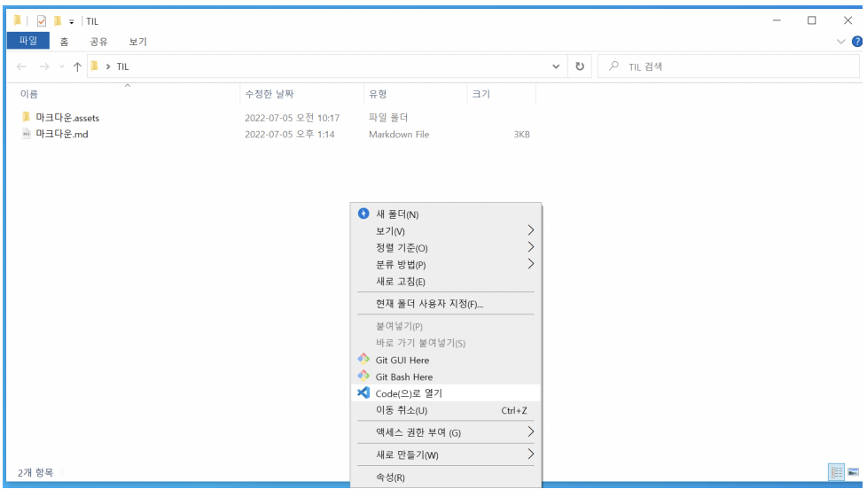

# 마크다운

[마크다운](./markdown)

[이미지](./images)

[문서](./document)

**KDT 1기 1회차 신현강**

_KDT 1기 1회차 신현강_

> KDT 1기 1회차 신현강

1. KDT 1기 1회차 신현강
2. KDT 1기 1회차 신현강

- KDT 1기 1회차 신현강
- KDT 1기 1회차 신현강

'KDT 1기 1회차 신현강'

---

[title](https://www.example.com)

KDT 1기 1회차 신현강

| 이름   | 기수 | 회차  |
| ------ | ---- | ----- |
| 신현강 | 1기  | 1회차 |
|        |      |       |
|        |      |       |

#### heading



~~KDT 1기 1회차 신현강~~

**KD

KDT 1기 *1회차* 신현강

# 마크다운 정리

# 제목/소제목 (heading)

1. #의 개수에 따라 h1 ~h6까지 표현 가능하다.

   #### h3

   ##### h4

   ##### h5

   ###### h6

2. 목록 (list)

   순서가 없는 리스트 : -

   - 사과
   - 바나나
     - 미니 바나나
     - Dole 바나나
   - 딸기
     - 산딸기
   - 복숭아
     - 백도 복숭아
     - 천도 복숭아

3. 순서가 있는 리스트 : 1.

   1. 세수하고 양치
   2. 산책
   3. syllaverse 홈페이지 접속한다.
      1. 로그인
      2. 대시보그 확인
   4. 유튜브 라이브에 접속한다
      1. 인사를 남긴다.

4. # inline code block

   <code>print</code> 는 파이썬에서 

   

5. 

6. 6

7. 7

8. 8

9. 


# Python

---

## 1. 개요

---


## 2. 특징

파이썬(Python)은 1990년 암스테르담의 귀도 반 로섬(Guido Van Rossum)이 개발한 인터프리터 언어이다. 귀도는 파이썬이라는 이름을 자신이 좋아하는 코미디 쇼인 "몬티 파이썬의 날아다니는 서커스(Monty Python’s Flying Circus)"에서 따왔다고 한다.

> 인터프리터 언어란 한 줄씩 소스 코드를 해석해서 그때그때 실행해 결과를 바로 확인할 수 있는 언어이다.

1. #### **파이썬은 인간다운 언어이다. 아래 코드는 쉽게 해석된다.**

   ```python
   if 4 in [1,2,3,4]: print("4가 있습니다")
   ```

   만약 4가 1, 2, 3, 4 중에 있으면 "4가 있습니다"를 출력한다. 라고 말이다.

2. #### **파이썬은 간결하다.**

   ```python
   simple.py
   languages = ['python', 'perl', 'c', 'java']

   for lang in languages:
   if lang in ['python', 'perl']:
   print("%6s need interpreter" % lang)
   elif lang in ['c', 'java']:
   print("%6s need compiler" % lang)
   else:
   print("should not reach here")
   ```

3. #### **공식문서가 자세히 제공된다.**

[파이썬 공식문서 링크](https://docs.python.org/3/)
